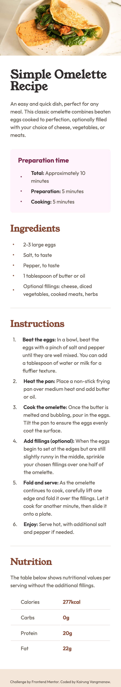
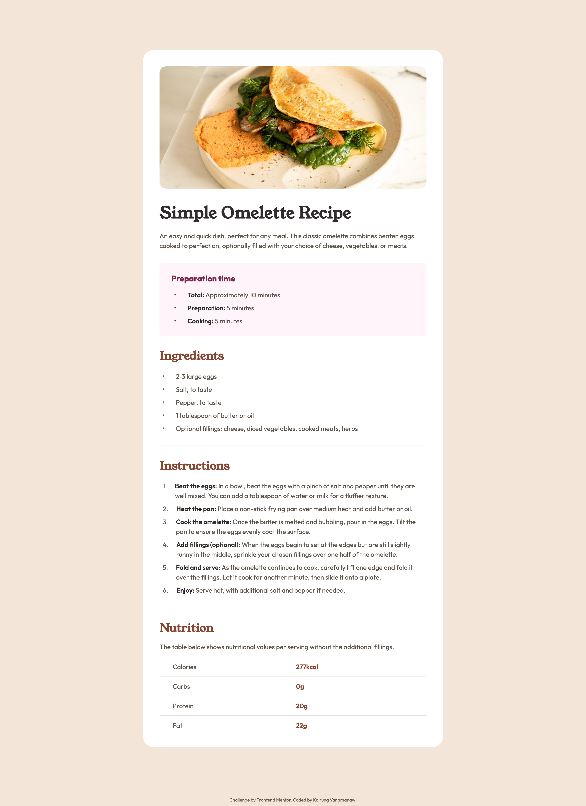

# Frontend Mentor - Recipe page solution


This is a solution to the [Recipe page challenge on Frontend Mentor](https://www.frontendmentor.io/challenges/recipe-page-KiTsR8QQKm). Frontend Mentor challenges help you improve your coding skills by building realistic projects. 

## Table of contents

- [Frontend Mentor - Recipe page solution](#frontend-mentor---recipe-page-solution)
  - [Table of contents](#table-of-contents)
  - [Overview](#overview)
    - [Screenshot](#screenshot)
    - [Links](#links)
  - [My process](#my-process)
    - [Built with](#built-with)
    - [What I learned](#what-i-learned)
    - [Continued development](#continued-development)
    - [Useful resources](#useful-resources)
    - [AI Collaboration](#ai-collaboration)
  - [Author](#author)
  - [Acknowledgments](#acknowledgments)

## Overview

### Screenshot

<details>
  <summary>Mobile view</summary>
  
</details>

<details>
  <summary>Desktop view</summary>
  
</details>

### Links

- Solution URL: [Recipe Page with React, Vite, BEM & WCAG-Compliant Accessibility](https://www.frontendmentor.io/solutions/recipe-page-responsive-design-by-html5-and-sassy-css-sass-_FFCZSPcl4)
- Live Site URL: [Frontend Mentor | Recipe page](https://challenged-by-frontend-mentor.github.io/recipe-page/)

## My process

### Built with

- [React](https://react.dev/?utm_source=gemini) - JS library for building user interfaces
- [Vite](https://vitejs.dev/?utm_source=gemini) - Next Generation Frontend Tooling
- [Semantic HTML5 markup](https://developer.mozilla.org/en-US/docs/Glossary/HTML5?utm_source=gemini)
- [CSS Custom Properties](https://developer.mozilla.org/en-US/docs/Web/CSS/--*?utm_source=gemini) (Variables)
- Flexbox & CSS Grid
- Mobile-first workflow
- BEM (Block Element Modifier) architecture
- [WCAG & ARIA Guidelines](https://www.w3.org/WAI/standards-guidelines/wcag/?utm_source=gemini) for Accessibility

### What I learned

Throughout this challenge, I tackled several layout and accessibility hurdles that significantly improved my frontend workflow:

1. **Multiline List Indentation & Layout Structure:**
   I learned how to properly align multiline list items without letting text wrap under custom bullets or numbers. By wrapping the content in a dedicated `<span>` element (like `.instructions__content`), the text stays neatly aligned in a single flex box layout.

2. **CSS Counters & Custom Markers:**
   I deepened my understanding of CSS list styling using `counter-reset` and `counter-increment` alongside pseudo-elements (`::before`), as well as utilizing native CSS list-markers (`::marker`) to style custom order numbers cleanly.

3. **Accessible Tables (WCAG Compliance):**
   I refined my approach to accessible HTML table structures by implementing `<th scope="row">` for data association and using visually hidden captions (`.sr-only`) to provide context for screen readers without breaking the visual design.

```html
  <!-- Accessible table structure with screen reader caption -->
  <table className="nutrition__table">
    <caption className="sr-only">Nutritional values per serving</caption>
    <tbody className="nutrition__body">
      <tr className="nutrition__item">
        <th scope="row" className="nutrition__nutrient">Calories</th>
        <td className="nutrition__value">277kcal</td>
      </tr>
    </tbody>
  </table>
```

### Continued development

In upcoming projects, I plan to continue focusing on:

- **Advanced Accessibility Practices:** Deepening my knowledge of complex ARIA patterns and testing directly with screen readers (like VoiceOver and NVDA).

- **Micro-interactions & Animations:** Adding smooth CSS transitions and subtle UI feedback to enrich the user experience.

- **Component Optimization:** Refining React component boundaries and state management techniques for larger, more complex applications.

### Useful resources

- [MDN Web Docs: list-style-type](https://developer.mozilla.org/en-US/docs/Web/CSS/Reference/Properties/list-style-type?utm_source=gemini) - Helped me understand native list marker properties and standard bullet behaviors.

- [MDN Web Docs: CSS Counters](https://developer.mozilla.org/en-US/docs/Web/CSS/Reference/Values/counter?utm_source=gemini) - Essential guide for setting up CSS `counter-reset` and `counter-increment` for numbered lists.

### AI Collaboration

This project was built with the assistance of Gemini and Google Search AI Mode for code reviews, refining accessibility standards (WCAG), and optimizing BEM architecture.

## Author

- GitHub: [Kairung Vangmanaw](https://github.com/VangmanawKairung)
- Frontend Mentor - [@VangmanawKairung](https://www.frontendmentor.io/profile/VangmanawKairung)

## Acknowledgments

I want to express my deepest gratitude to myself for pushing through every layout challenge and staying committed to writing clean code. Special thanks to my family for their constant support, and to the Frontend Mentor team for creating such well-crafted challenges that sharpen real-world developer skills.

I’m also grateful for the amazing tools that streamlined my development process—including AI collaborators like Gemini, VS Code along with its essential extensions, Chrome DevTools, and even macOS Preview, which allowed me to quickly measure precise pixel values and speed up my workflow alongside design overlays.
